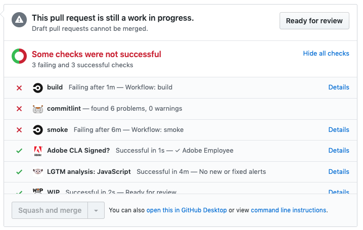
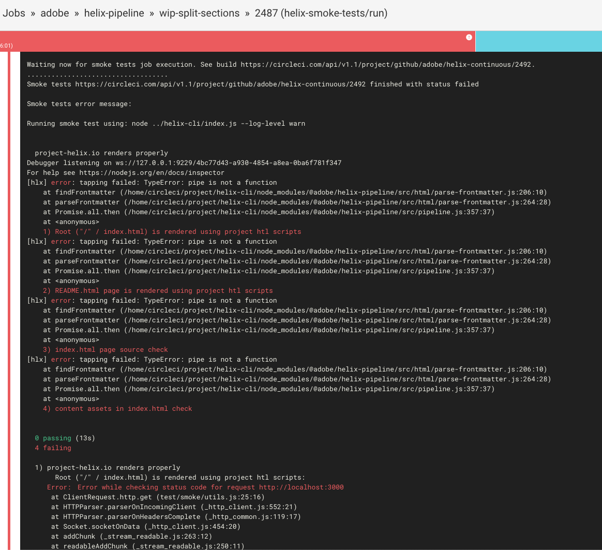
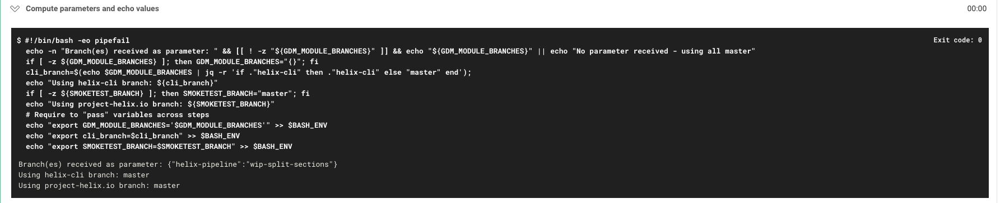

# helix-smoke-tests orb

Goal of this orb - provide the necessary CircleCI steps to run smoke tests when pushing to a branch of one of the Helix repository. This is required to validate that the changes made do not break the helix-cli and our consumer websites. The orb runs the following steps:

* call CircleCI API to launch the smoke tests stored in this repository passing the current branch as a parameter
* ([smoke tests](../../config.yml) are executed from within this repository)
* the orb wait for smoke tests execution
* the result of the test are returned and appears as part of the Pull Request validation: if the smoke test fails, the PR will be flagged as failing.

## Usage

To integrate this orb to a CircleCI config, include the following line to `.circleci/config.yml` of Helix repo that needs to trigger the smoke when code is changed:

```yml
orbs:
  helix-smoke-tests: adobe/helix-smoke-tests@0.0.7

workflows:
  # ...
  # should contain repo build steps
  
  smoke:
    jobs:
    - helix-smoke-tests/run:
        token: ${SMOKE_TEST_TOKEN}
        remote_repo: adobe/helix-continuous
```

`SMOKE_TEST_TOKEN` is an environment variable that needs to be added to the project that consumes the orb: it corresponds to [CircleCI API token](https://circleci.com/gh/adobe/helix-continuous/edit#api) of the helix-continuous in order to be able to trigger the smoke tests job "remotely".

The `remote_repo` property is the repo where the smoke tests are stored. For now, it is always `adobe/helix-continuous`.

You can validate the new `config.yml` file with command: `circleci config process .circleci/config.yml`

Note: orb are CircleCI v2.1 feature. Config must be v2.1 and `Enable build processing (preview)` must be enabled in the [advanced settings](https://circleci.com/gh/adobe/hypermedia-pipeline/edit#advanced-settings).

## Debug

### Basic steps

When using the orb in a project, each PR from that project will have a `smoke — Workflow: smoke` validation check. If this fails, this usually means the smoke tests failed and your code / PR breaks "something". Now the task is to find what.

To check the execution result of the smoke tests, from the PR you can click on the "Details" link next to `smoke Failing after Xm — Workflow: smoke` check and follow the links to CircleCI:



This should take you to something like [](https://circleci.com/gh/adobe/helix-pipeline/2487) (example of failing smoke tests): at the bottom of this page, you can see the result of the tests.



For now, the smoke tests are very basic and consist into cloning [](https://github.com/adobe/project-helix.io), running `hlx up` in the project folder and checking that some basic requests return the expected HTML.

If the smoke tests are all red, this is usually the sign of something globally broken and running `hlx up` (`hlx` being patched with your changes) on any project should be easy to reproduce.

If only one smoke test fails, then you would need to understand which part of the product your code broke. Checking the [smoke tests sources](https://github.com/adobe/project-helix.io/tree/master/test/smoke) to know what the test is doing is usually a good start point.

The smoke test job of your repo is mainly to call another job in the [](https://github.com/adobe/helix-continuous) repository and wait for its execution. When execution is over, results are sent back to current job and displayed like on the picture above. The picture shows at first lines:

```text
Waiting now for smoke tests job execution. See build https://circleci.com/api/v1.1/project/github/adobe/helix-continuous/2492.
...................................
Smoke tests https://circleci.com/api/v1.1/project/github/adobe/helix-continuous/2492 finished with status failed
```

Those lines give you the job id: `adobe/helix-continuous/2492`. Opening the job in CircleCI would give you access to a few more info. You just need to adjust the url to reach [](https://circleci.com/gh/adobe/helix-continuous/2492).

The `Compute parameters and echo values` workflow step tells you:



* the branch(es) received as parameter (`{"helix-pipeline":"wip-split-sections"}` - `helix-cli` was patched using branch `wip-split-sections` of `helix-pipeline`)
* the helix-cli branch used to run the smoke tests (`master` in that case)
* the `project-helix.io` branch (`master` in that case)

The `Run Smoke Tests on project-helix.io` workflow step is the actual execution of the smoke tests, results are sent back to calling job.

### Advanced steps

To run the smoke tests like they are executed by CircleCi, you need to run the following steps:

1. Clone [helix-continuous](https://github.com/adobe/helix-continuous):

`git clone --branch master --single-branch --depth 1 https://github.com/adobe/helix-continuous.git`

2. Setup the GDM (Git Dependency Maker):

`cd helix-continuous/scripts/gdm; npm install; cd ../../..`

3. Clone [helix-cli](https://github.com/adobe/helix-cli): 

`git clone --branch master --single-branch --depth 1 https://github.com/adobe/helix-cli.git`

4. Run GDM on helix-cli (~ construct a cli patched with your changes):

`cd helix-cli; env GDM_MODULE_BRANCHES='{"<project_your_are_working_on>": "<branch_of_project_your_are_working_on>"}' node ../helix-continuous/scripts/gdm/index.js; cd ..`

5. Clone [project-helix.io](https://github.com/adobe/project-helix.io) and install:

`git clone --single-branch --depth 1 -b master https://github.com/adobe/project-helix.io.git; cd project-helix.io; npm install; cd ..`

6. Finally, run the smoke tests:

`cd project-helix.io; env HLX_SMOKE_EXEC='node ../helix-cli/index.js --log-level warn' npx mocha --exit test/smoke/*; cd ..`

If you are building a backward compatibility change, you need to update [project-helix.io](https://github.com/adobe/project-helix.io). At step 5, you can clone the project with the branch including your required changes.